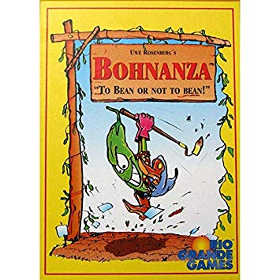

```{r setup, include=FALSE}
knitr::opts_chunk$set(echo = FALSE, message=FALSE, warning=FALSE)

library(tidyverse)
library(assertthat)
theme_set(theme_bw())

```


```{r custom-foo, echo=FALSE}
cond_prob <- function(frequency=NA, num_cards=NA, total_cards=NA){
  current_prob <- 1
  (frequency-num_cards+1)
  for(i in frequency:(frequency-num_cards+1)){
    new_prob = i / total_cards
    total_cards = total_cards - 1 #Update number of cards in deck. 
    current_prob = current_prob * new_prob
  }
  return(current_prob)
}
#assertthat::are_equal(cond_prob(24, 4, 154), (24/154 * 23/153 * 22/152 * 21/151))
```


```{r data}
b_data <- read_csv("bohnanza_cards.csv")
total_cards <- sum(b_data$Frequency)
b_data_tidy <- b_data %>%
  pivot_longer(cols=P1:P4, values_to = "num_cards") %>% 
  mutate(points = gsub(name, pattern="P", replacement=""),
         points = as.numeric(points)) %>% 
  mutate(value_per_card = points/num_cards) %>% 
  filter(is.infinite(value_per_card)==F) #Might need to change this later based on analysis

b_data_tidy$prob_achieving_level <- mapply(cond_prob, b_data_tidy$Frequency, b_data_tidy$num_cards, total_cards)
b_data_tidy <- b_data_tidy %>% 
  mutate(new_term = value_per_card / (1/prob_achieving_level))


```



Rio Grande Games has a great game called [Bohnanza](https://www.amazon.com/gp/product/B00008URUS/ref=as_li_tl?ie=UTF8&camp=1789&creative=9325&creativeASIN=B00008URUS&linkCode=as2&tag=tcashion-20&linkId=20a522f051ebafd8d5e367eb94d6a1b9). The objective of the game is to make the most money by planting different bean fields, where different types of beans require a different number of beans to get to the next value level. There are 4 values levels (of 1, 2, 3, and 4 coins) in the game with not every type of bean having each level. Different beans have different frequencies in the deck which roughly correspond to how many of them you need to plant to get to the next level of value. 


```{r}
knitr::kable(b_data, caption="Bean types with their frequency and number of beans needed to reach different point levels.")
```

We assume this relationship roughly exists with as frequency decreases value (or value per card) increases. We calculate value per card as the number of coins divided by the number of bean cards needed to reach that level. We can then plot this with a regression line overlaid and see it is roughly linear relationship. 

```{r frequency-vs-value, fig.cap="*Linear relationship between frequency and value per card.*"}
linmod_frequency <- lm(value_per_card~Frequency, data=b_data_tidy)

b_0 <- round(broom::tidy(linmod_frequency) %>% filter(term=="(Intercept)") %>% pull(estimate), 2)
b_1 <- round(broom::tidy(linmod_frequency) %>% filter(term=="Frequency") %>% pull(estimate), 2)
r_2 <- round(broom::glance(linmod_frequency) %>% pull(r.squared),2)

b_data_tidy %>% 
  ggplot(aes(x= Frequency, y=value_per_card)) + 
  geom_point(alpha=0.3) + 
  geom_smooth(method="lm") + 
  labs(y="Value per Card") + 
  annotate("text", label = paste0("y = ", b_0, " + ", b_1, "x"), x=17, y=0.75) + 
  annotate("text", label = paste0("R^2 = ", r_2), x=17, y=0.70) + 
  NULL

  
```


Because it takes you different amount of cards to get to the different point levels of each bean type, I assumed it was unlikely that they were balanced perfectly. So, if you could find which cards have higher probability of getting to the different coin levels first, you could exploit this to beat your friends at the game. 


From here, I calculated the conditional probability of getting to each level. I assumed you would not be replacing the cards in the deck after one is drawn (which makes sense for the first round of the game). So the conditional probability is  P(A) * P(B|A), where P(A) is the probability of drawing the first bean of a certain type, and P(B|A) is the probability of drawing another bean of that type. I continue this on to reach the different numbers of beans required for each point level (which ranges from 2 beans to 12 beans). 

For example, to get 2 coins from a coffee bean farm you need 7 coffee beans. The probability of that is:
24/154 * 23/153 * 22/152 * 21/151 * 20/150 * 19/149 * 18/148
=
9.75e-07

When we plot this out with probability on the x-axis and point values on the y-axis it looks like this:

```{r main-plot, fig.cap="*Probability of achieving goal vs Coins.*"}
#Main graph to illustrate finding.
b_data_tidy %>% 
  ggplot(aes(x=prob_achieving_level, y=as.factor(points), color=Type)) + 
  geom_point(alpha=0.7) + 
  scale_color_brewer(type="qual", palette = "Paired") + 
  scale_x_log10() + 
  labs(x="Log Probability", y="Coins", color="Bean Type") + 
  NULL


```


But what we should look for is the beans at the right end of each different point level as 'best performers' and the the beans at the left end of each level as 'worst performers'. From this, we can see that the odds of getting to a top level of the coffee bean (3 or 4 coins) is VERY LOW, even though they are super common in the deck (~16% of the deck at the start). And if you want to just get to the first coin level as easy as possible, the Soy Bean is the way to go. 


```{r outlier-plot, fig.cap="*Probability of achieving goal vs Coins with 'outliers' highlighted.*", fig.width=8, fig.height=6}

#Highlight 'outliers' 
beans_of_interest <- c("Coffee", "Red", "Garden", "Soy")
outlier_labels <- b_data_tidy %>% 
  filter(Type %in% beans_of_interest)
b_data_tidy %>% 
  ggplot(aes(x=prob_achieving_level, y=as.factor(points), color=Type)) + 
  geom_point(alpha=0.7) + 
  scale_color_brewer(type="qual", palette = "Paired") + 
  scale_x_log10() + 
  labs(x="Log Probability", y="Coins", color="Bean Type") + 
  geom_label(data=outlier_labels, 
             aes(x=prob_achieving_level, y=as.factor(points), color=Type, label=Type)) + 
  NULL

```

I think there are some other metrics that could synthesize the trade-offs between value per card, expected return, and probability, but this is still a work in progress. If you have any ideas, feel free to reach out or build on the analysis yourself. All code is available [here]().
